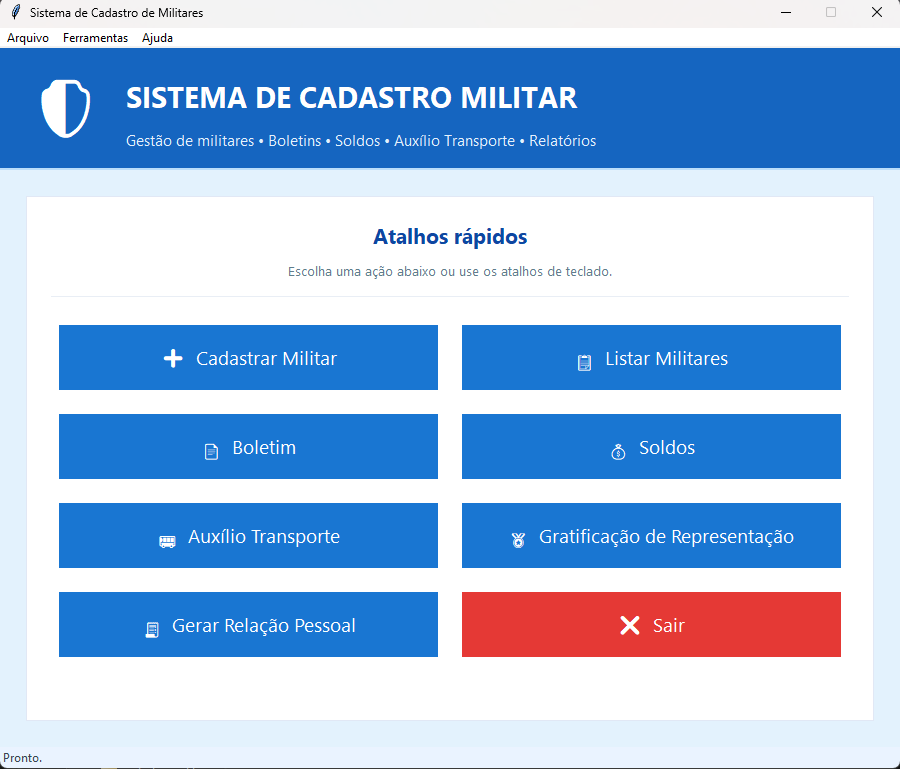

# Sistema de Cadastro de Militares (Tkinter + SQLite)

Aplicação desktop em **Python/Tkinter** para cadastro e gestão de militares, com persistência em **SQLite** e recursos de **importação/exportação para Excel**.

> **Objetivo**: sistema simples, direto e funcional para uso interno, sem dependência de servidor.  
> **Observação**: este repositório preserva o **código original**, sem alterações estruturais.

## Funcionalidades
- Cadastro completo de militares (dados pessoais, bancários e administrativos)
- Listagem e edição com interface Tkinter
- Importação/Exportação para **Excel (.xlsx)**
- Geração de relatórios (ex.: relação de pessoal)
- Catálogos de **Postos/Graduações** e **Bancos** com “seed” automático
- Banco **SQLite** embutido (`militares.db`)

## Stack
- **Linguagem**: Python 3.10+  
- **GUI**: Tkinter/ttk  
- **Banco de Dados**: SQLite  
- **Planilhas**: openpyxl

## Estrutura de Pastas
```
cadastro_militares/
├─ main.py
├─ militares.db
├─ impor_export.py
├─ database/
│  ├─ db.py
│  └─ __init__.py
├─ interface/
│  ├─ janela_principal.py
│  ├─ cadastro_militar.py
│  ├─ listar_militares.py
│  ├─ boletim.py
│  ├─ gratificacao.py
│  ├─ auxilio_transporte.py
│  ├─ soldos.py
│  └─ __init__.py
└─ relatorios/
   ├─ relacao_pessoal.py
   └─ __init__.py
```

## Como rodar localmente
> Testado em Windows. Em Linux/macOS os comandos são equivalentes.

1. **Clone** o repositório:
   ```bash
   git clone https://github.com/seu-usuario/cadastro-militares-tkinter.git
   cd cadastro-militares-tkinter/cadastro_militares
   ```

2. **Crie e ative** um ambiente virtual (recomendado):
   ```bash
   python -m venv .venv
   .venv\Scripts\activate  # Windows
   # source .venv/bin/activate  # Linux/macOS
   ```

3. **Instale dependências**:
   ```bash
   pip install -r requirements.txt
   ```

4. **Execute**:
   ```bash
   python main.py
   ```

> O arquivo `militares.db` é criado/ajustado automaticamente na primeira execução (seed de catálogos de postos e bancos).

## Importação/Exportação (Excel)
- O módulo `impor_export.py` oferece:
  - `exportar_para_excel(...)` → gera uma planilha com os registros
  - `importar_de_excel(...)` → lê uma planilha no padrão esperado e insere/atualiza registros
- Recomendação: comece exportando para ver o **layout de colunas** esperado e então preencha sua planilha seguindo o mesmo padrão.

## Banco de Dados
- SQLite local (`militares.db`), criado automaticamente na raiz do projeto (`/cadastro_militares`).
- Índices e estrutura são geridos por `database/db.py`.
- Backup simples: copie o arquivo `militares.db`.

## Roadmap (opcional)
- [ ] Paginação/Busca avançada na listagem
- [ ] Validações de CPF/IDT no backend
- [ ] Tema visual coeso (ttk) em todas as telas
- [ ] Ícones nos botões principais
- [ ] Testes automatizados básicos (unittest/pytest)

## Capturas de tela




## Licença
Distribuído sob licença **MIT**. Veja `LICENSE` para detalhes.

---

Feito com propósito e disciplina. Qualquer sugestão de melhoria é bem-vinda! 🙌
